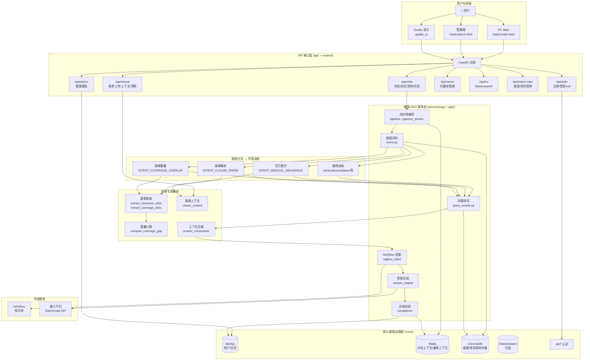
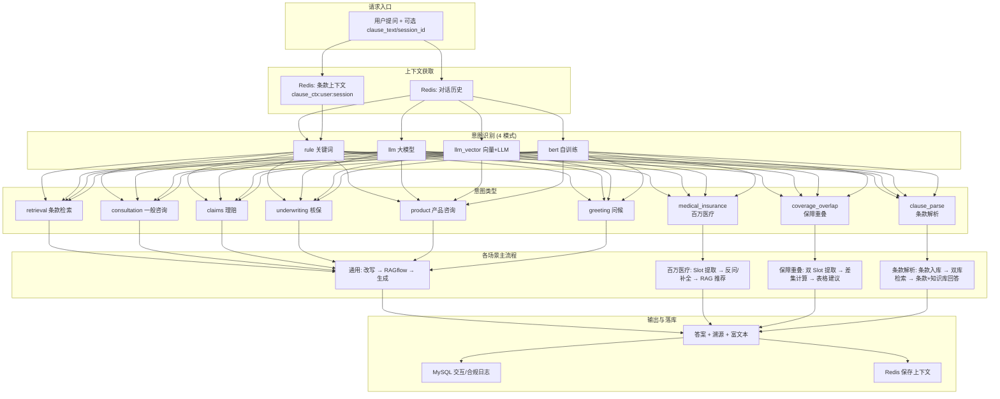
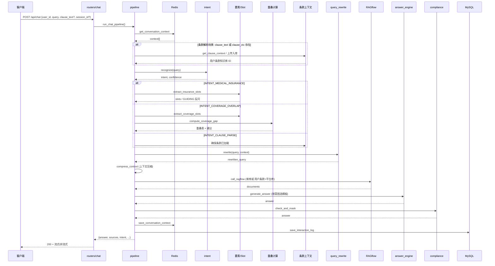
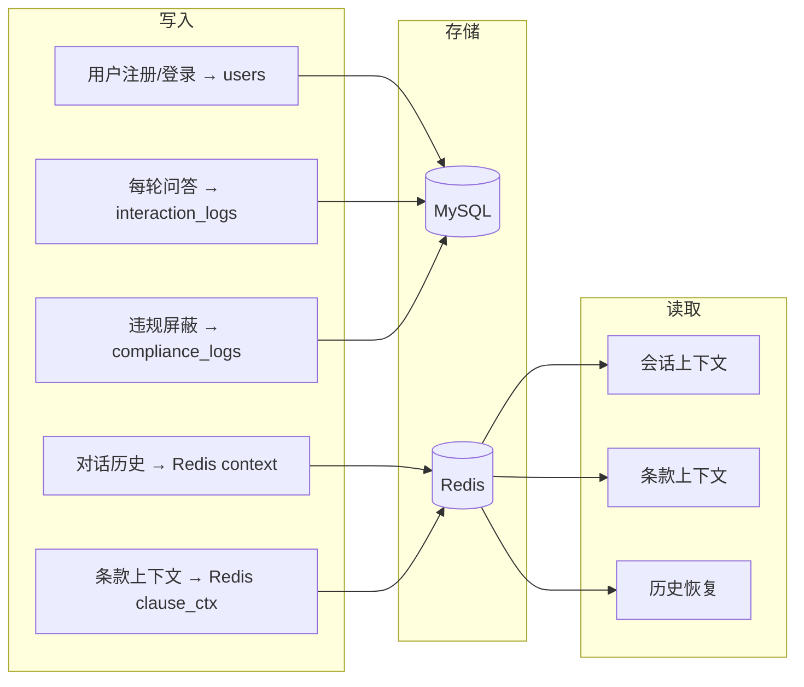

# 智保灵犀（InsurGuide）—— 全部场景整体架构

> 基于整个项目的一体化架构视图，覆盖通用咨询、百万医疗推荐、保障重叠度透视镜、医疗条款解析等所有业务场景  
> 文档版本：v1.0 | 生成日期：2026-02-28

---

## 一、架构总览

智保灵犀是基于 FastAPI、LangChain、RAGflow 的智能保险指南与增强 RAG 系统，采用**分层架构**，支持多轮对话、意图识别、问题改写、知识库检索、答案生成与合规校验，并针对不同业务场景（百万医疗、保障重叠、条款解析）提供专用流程。

---

## 二、全部场景整体架构图



---

## 三、全场景意图分支与数据流



---

## 四、增强 RAG 流水线（全场景统一编排）



---

## 五、场景与模块映射表

| 业务场景 | 意图 | 专用模块 | 知识库来源 | 输出形式 |
|---------|------|----------|------------|----------|
| **通用保险咨询** | retrieval, consultation, claims, underwriting, product | 无 | RAGflow 主库 | 口语化 + 引用 |
| **百万医疗险推荐** | INTENT_MEDICAL_INSURANCE | extract_insurance_slots, Slot Filling 反问 | RAGflow 主库 | 产品列表 + 推荐理由 |
| **保障重叠度透视镜** | INTENT_COVERAGE_OVERLAP | extract_coverage_slots, compute_coverage_gap | RAGflow 主库 + 保障知识 | 重叠表 + 买/不买/换建议 |
| **医疗条款解析与咨询** | INTENT_CLAUSE_PARSE | clause_context, 条款上传/入库 | 用户条款库 + RAGflow 主库 | 条款解读 + 知识库补充 |
| **问候/其他** | greeting, other | 无 | 可选 | 简单回复 |

---

## 六、技术栈与目录结构

### 6.1 技术栈

| 层次 | 技术 |
|------|------|
| 后端 | Python 3.9+、FastAPI、Uvicorn |
| 配置 | pydantic-settings、.env |
| 数据库 | MySQL（用户、日志）、Redis（上下文） |
| 检索 | RAGflow（主知识库）、ChromaDB（规则向量）、可选 ES |
| 大模型 | 通义千问（DashScope），支持专业版/标准版 |
| 前端 | PC Web 静态页、Gradio、管理端 admin.html |
| 认证 | JWT、bcrypt |

### 6.2 核心目录结构

```
InsurGuide/
├── api/main.py              # FastAPI 入口、路由、静态资源
├── routers/                  # 认证、对话、条款、向量、ES、规则、管理
├── app/                      # 意图、改写、答案、合规、条款上下文、保障重叠、要素提取
├── services/rag/             # pipeline、pipeline_stream、recall、fusion、rerank
├── core/                     # MySQL、Redis、ChromaDB、ES、JWT
├── models/                   # User、InteractionLog、ComplianceLog
├── config/                   # settings、constants
├── gradio_ui/                # Gradio 演示（认证、对话、条款）
└── web/static/               # index.html、admin.html
```

---

## 七、API 路由总览

| 路由 | 功能 | 场景关联 |
|------|------|----------|
| POST /api/auth/register | 注册 | 全场景鉴权 |
| POST /api/auth/login | 登录 | 全场景鉴权 |
| GET /api/auth/me | 当前用户 | 全场景鉴权 |
| POST /api/chat | 对话（非流式） | 全场景 |
| POST /api/chat/stream | 对话（流式） | 全场景 |
| POST /api/chat/clear | 清除上下文 | 全场景 |
| GET /api/chat/history | 历史记录 | 全场景 |
| POST /api/chat/context/restore | 恢复历史+条款 | P2-11 |
| POST /api/clause/upload | 条款上传 | 条款解析 |
| GET /api/clause/context | 条款上下文 | 条款解析 |
| POST /api/clause/clear | 清除条款 | 条款解析 |
| /api/vector/* | 向量库 | 意图/改写规则 |
| /api/es/* | ES | 可选检索 |
| /api/intent-rules/* | 意图规则 | llm_vector 模式 |
| /api/admin/* | 管理看板 | P1-7 |

---

## 八、数据存储与流转



---

## 九、P0 / P1 / P2 功能在架构中的位置

| 阶段 | 功能 | 架构位置 |
|------|------|----------|
| **P0** | 条款解析闭环：上传、解析、多轮咨询 | routers/clause、app/clause_context、RAGflow 多库检索 |
| **P0** | 前端条款状态栏、clause_loaded 展示 | web/static/index.html、routers/chat |
| **P1-5** | 条款粘贴入口 | web 前端、chat 请求 clause_text |
| **P1-6** | 条款结构化抽取 | app 层、前端卡片展示 |
| **P1-7** | 管理端看板 | routers/admin、/static/admin.html |
| **P1-8** | clause_loaded 流式展示 | answer_engine、chat 响应 |
| **P2-10** | Gradio 条款解析入口 | gradio_ui/pages/chat |
| **P2-11** | 历史恢复 clause 关联 | POST context/restore、Redis clause_ctx |
| **P2-12** | 智能推荐问题 | 条款加载后推荐问题、前端展示 |

---

## 十、文档索引

| 文档 | 说明 |
|------|------|
| [项目架构说明.md](../项目架构说明.md) | 整体架构、流程图、技术栈、依赖、代码结构 |
| [架构说明.md](../架构说明.md) | 分层与目录职责、RAG 流水线、扩展性 |
| [智保灵犀·医疗条款解析与咨询_可执行产品方案.md](../产品需求/智保灵犀·医疗条款解析与咨询_可执行产品方案.md) | 条款解析场景 |
| [智保灵犀·保障重叠度透视镜_可执行产品方案.md](../产品需求/智保灵犀·保障重叠度透视镜_可执行产品方案.md) | 保障重叠场景 |
| [智保灵犀_P0前端条款解析闭环_产品技术方案.md](../产品需求/智保灵犀_P0前端条款解析闭环_产品技术方案.md) | P0 闭环 |
| [智保灵犀_P1高价值功能增强_产品技术方案.md](../产品需求/智保灵犀_P1高价值功能增强_产品技术方案.md) | P1 增强 |
| [智保灵犀_P2加分项_产品技术方案.md](../产品需求/智保灵犀_P2加分项_产品技术方案.md) | P2 加分项 |

---

*本文档为智保灵犀全部场景的一体化架构视图，便于研发、产品与汇报使用。*
