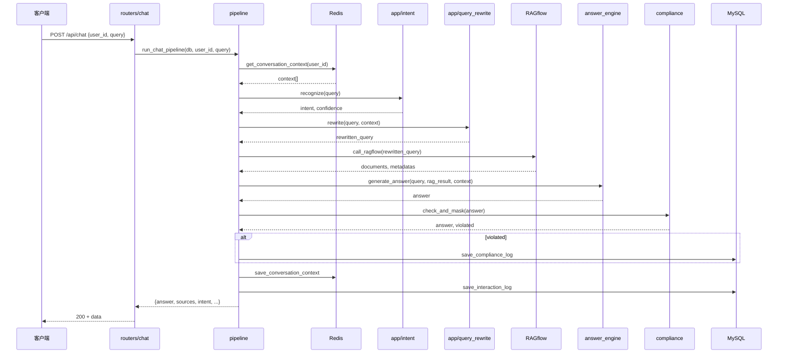
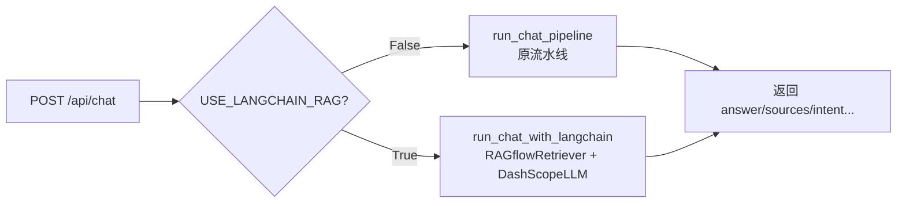
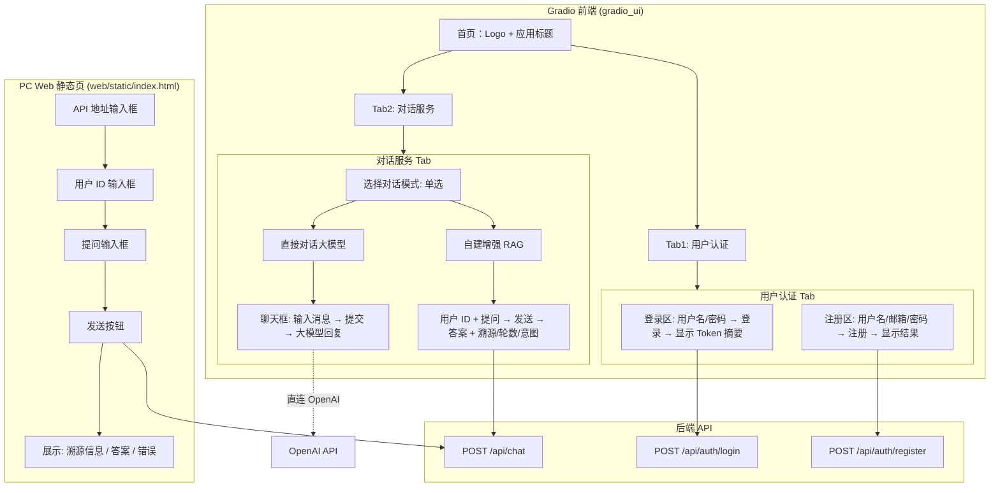

# InsurGuide 智保灵犀 - 项目架构说明

本文档面向参与开发的同事，说明整体架构、技术栈、依赖环境、功能与代码结构、Python 包依赖及前端交互，便于快速理解与协作。

---

## 一、项目整体架构图

```mermaid
flowchart TB
    subgraph 用户与前端
        U[用户]
        GW[PC Web 静态页<br/>/static/index.html]
        GD[Gradio 演示<br/>gradio_ui]
    end

    subgraph API 接口层 api/ + routers/
        A[FastAPI 应用]
        R1[/api/auth 认证]
        R2[/api/chat 对话]
        R3[/api/vector 向量]
        R4[/api/es ES]
        R5[/api/intent-rules 规则]
    end

    subgraph 增强 RAG 服务层 services/rag/ + app/
        P[流水线 pipeline]
        I[意图识别 app/intent]
        Q[问题改写 app/query_rewrite]
        RF[RAGflow 检索]
        ANS[答案生成 app/answer_engine]
        C[合规 app/compliance]
    end

    subgraph 核心基础设施层 core/
        DB[(MySQL)]
        RD[(Redis)]
        VDB[ChromaDB 向量库]
        ES[Elasticsearch]
        AUTH[JWT 认证]
    end

    subgraph 配置层 config/
        CF[settings + constants]
    end

    U --> GW
    U --> GD
    GW -->|HTTP| A
    GD -->|HTTP| A
    A --> R1 & R2 & R3 & R4 & R5
    R2 --> P
    P --> I --> Q --> RF --> ANS --> C
    P --> RD
    ANS --> RF
    R1 --> AUTH
    R2 --> DB
    R3 --> VDB
    R4 --> ES
    I --> VDB
    Q --> VDB
    CF --> A & P & core
    DB & RD & VDB & ES & AUTH --> CF
```

---

## 二、核心流程图

### 2.1 增强 RAG 单轮对话流程（POST /api/chat）



### 2.2 配置开关：原 pipeline 与 LangChain 编排



---

## 三、技术框架与中间件

| 分类 | 选型 | 说明 |
|------|------|------|
| **Web 框架** | FastAPI | 异步、自动 OpenAPI 文档、依赖注入 |
| **ASGI 服务器** | Uvicorn | 运行 api.main:app |
| **配置** | pydantic-settings + .env | 环境变量与 .env 覆盖 |
| **关系库** | MySQL + SQLAlchemy 2.x | 用户、交互日志、合规日志 |
| **缓存/上下文** | Redis | 多轮对话上下文，Key: context:{user_id} |
| **向量库** | ChromaDB | 意图规则、改写示例；LangChain 可接 Chroma |
| **知识库检索** | RAGflow HTTP API | 主检索由 RAGflow 完成 |
| **全文检索（可选）** | Elasticsearch | 可选，非主流程依赖 |
| **认证** | JWT (python-jose) + passlib bcrypt | 登录签发 token，需登录接口带 Bearer |
| **HTTP 客户端** | httpx | 调 RAGflow、大模型 API |
| **大模型** | 通义千问 / OpenAI 兼容 API | 答案生成、意图、改写；可选本地 Qwen |
| **前端演示** | Gradio | gradio_ui 包，注册/登录/对话服务 |
| **RAG 编排扩展** | LangChain | 可选 USE_LANGCHAIN_RAG，Retriever + Chain + DashScopeLLM |

---

## 四、项目依赖的服务与环境

### 4.1 必须就绪的服务

| 服务 | 用途 | 配置项示例 |
|------|------|------------|
| **MySQL** | 用户表、交互日志、合规日志 | MYSQL_HOST, MYSQL_PORT, MYSQL_USER, MYSQL_PASSWORD, MYSQL_DATABASE |
| **Redis** | 多轮对话上下文 | REDIS_HOST, REDIS_PORT, REDIS_DB, REDIS_PASSWORD |
| **RAGflow** | 知识库检索（增强 RAG 必选） | RAGFLOW_API_URL, RAGFLOW_API_KEY, RAGFLOW_KNOWLEDGE_BASE_ID |
| **大模型 API** | 答案生成（通义/OpenAI 等） | DASHSCOPE_API_KEY 或 OPENAI_API_KEY |

### 4.2 可选服务

| 服务 | 用途 | 说明 |
|------|------|------|
| **Elasticsearch** | 向量/ES 相关 API、检索实验 | 未部署时相关路由可能报错，不影响 /api/chat |
| **ChromaDB** | 意图/改写规则、LangChain Chroma | 本地目录，无需独立进程 |
| **自训练 BERT 意图 API** | 意图识别 bert 模式 | BERT_INTENT_API_URL，未配置则用 rule/llm 等 |

### 4.3 环境要求

- **Python**：3.9 及以上（推荐 3.10+）
- **操作系统**：macOS / Linux / Windows 均支持（见第六节包依赖平台说明）
- **网络**：能访问 RAGflow、大模型 API（若用云端）；本地开发需可访问 localhost MySQL/Redis

---

## 五、主要功能说明、关键技术点与注意事项

### 5.1 主要功能

| 功能 | 说明 | 入口/配置 |
|------|------|-----------|
| **用户注册/登录** | 注册、登录、JWT、/api/auth/me | POST /api/auth/register, /api/auth/login |
| **增强 RAG 对话** | 多轮对话、意图识别、问题改写、RAGflow 检索、答案生成、合规 | POST /api/chat；USE_LANGCHAIN_RAG 可切换 LangChain 版 |
| **对话上下文清除** | 按 user_id 清空 Redis 上下文 | POST /api/chat/clear |
| **向量库管理** | 默认集合的增删查（需登录） | POST /api/vector/add, /query, DELETE /delete |
| **ES 管理（可选）** | 索引、搜索、健康检查（需登录） | /api/es/* |
| **意图/改写规则** | 向向量库写入意图规则、改写示例（llm_vector 模式用） | POST /api/intent-rules/add, /api/rewrite-rules/add |
| **Gradio 演示** | 注册、登录、对话服务（自建增强 RAG / 直接对话大模型） | python gradio_app.py |
| **PC Web 静态页** | 单页对话（可配置 API 地址） | /static/index.html |

### 5.2 关键技术点

- **意图识别**：支持 rule / llm / llm_vector / bert，由 INTENT_MODE 或请求体 intent_mode 控制；bert 超时自动兜底。
- **问题改写**：支持 rule / llm / llm_vector，用改写后的问句调 RAGflow，原始 query 用于生成与展示。
- **多路召回与精排**：services/rag 内 recall（RAGflow + 可选 Chroma）、fusion、rerank 已实现，当前 /api/chat 默认单路 RAGflow；LangChain 版可接 RAGflowRetriever + Chroma。
- **合规**：VIOLATION_WORDS 配置违规词，答案中替换为「[违规表述已屏蔽]」，并写 compliance_logs。
- **统一配置**：所有 URL、路由常量、开关集中在 config（settings + constants），Gradio 前端从 gradio_ui.config 读取，不写死。

### 5.3 注意事项

- 生产环境务必修改 **SECRET_KEY**，并收紧 CORS、RAGFLOW_API_KEY 等。
- Redis 未启动时多轮上下文不可用，但单轮问答仍可返回。
- RAGflow 未配置或不可达时，/api/chat 会返回错误信息，需保证 RAGFLOW_API_URL、RAGFLOW_KNOWLEDGE_BASE_ID 正确。
- 直接对话大模型（Gradio 或 LangChain）需 **OPENAI_API_KEY**；增强 RAG 答案生成用 **DASHSCOPE_API_KEY** 或 OPENAI_API_KEY。
- 表结构通过 **Base.metadata.create_all** 在启动时创建，首次部署前请确保 MySQL 已建库。

---

## 六、代码结构说明

```
InsurGuide/
├── main.py                 # 入口：启动 FastAPI（uvicorn api.main:app）
├── gradio_app.py           # Gradio 入口：启动 gradio_ui
├── config.py               # 兼容：from config import settings
├── config/                 # 配置层
│   ├── settings.py         # 所有配置项（.env 覆盖）
│   └── constants.py        # 意图枚举、API 路径常量等
├── core/                   # 核心基础设施
│   ├── database.py         # MySQL 连接、Session、Base
│   ├── redis_store.py      # 多轮对话上下文
│   ├── vector_db.py        # ChromaDB 封装
│   ├── es_client.py        # Elasticsearch 客户端
│   └── auth.py             # JWT、密码哈希、get_current_user
├── api/                    # API 入口
│   └── main.py             # FastAPI 应用、CORS、路由挂载、/health、/static
├── routers/                # 路由
│   ├── auth.py             # /api/auth 注册、登录、/me
│   ├── chat.py             # /api/chat、/api/chat/clear
│   ├── vector.py           # /api/vector 增删查
│   ├── es.py               # /api/es 索引、搜索、健康
│   └── intent_rewrite_rules.py  # /api/intent-rules/add、rewrite-rules/add
├── app/                    # 业务实现（与 pipeline 配合）
│   ├── intent.py           # 意图识别 rule/llm/llm_vector/bert
│   ├── query_rewrite.py   # 问题改写 rule/llm/llm_vector
│   ├── ragflow_client.py   # 调 RAGflow 检索
│   ├── answer_engine.py    # 答案生成、call_light_llm
│   ├── compliance.py      # 违规词检测与屏蔽
│   ├── chat_service.py    # chat_once 编排（可选，当前 chat 路由用 pipeline）
│   ├── context_store.py   # 兼容：转发 core.redis_store
│   ├── database.py        # 兼容：转发 core.database
│   ├── vector_db.py       # 兼容：转发 core.vector_db
│   ├── es_client.py       # 兼容：转发 core.es_client
│   ├── auth.py            # 兼容：转发 core.auth
│   └── llm_short.py       # 短文本 LLM（意图、改写用）
├── services/rag/           # 增强 RAG 服务
│   ├── pipeline.py        # run_chat_pipeline（原流水线）
│   ├── recall.py          # 多路召回
│   ├── fusion.py          # 融合去重
│   ├── rerank.py          # 精排
│   ├── _ragflow.py        # RAGflow 调用（召回层用）
│   ├── langchain_chain.py # run_chat_with_langchain
│   ├── langchain_ragflow_retriever.py  # RAGflow Retriever
│   ├── langchain_dashscope_llm.py      # DashScope LLM 封装
│   └── langchain_chroma.py             # Chroma VectorStore/Retriever
├── models/                 # ORM 模型
│   ├── user.py            # 用户表
│   └── chat_log.py        # 交互日志、合规日志
├── gradio_ui/              # Gradio 前端模块
│   ├── config.py          # 从 config 读 API 地址、路由、Logo、启动参数
│   ├── app.py             # build_demo、launch_demo
│   ├── components/        # 页头、Logo
│   ├── pages/             # Tab：auth、chat（对话服务二选一）
│   └── static/            # logo 占位图
├── web/static/             # PC Web 静态页
│   └── index.html         # 单页对话
├── tests/                  # 测试
├── doc/                    # 文档
└── requirements.txt
```

---

## 七、Python 包依赖与多平台说明

### 7.1 依赖列表（与 requirements.txt 对应）

| 包 | 用途 | macOS / Linux | Windows 说明 |
|----|------|---------------|--------------|
| fastapi | Web 框架 | 无差异 | 无差异 |
| uvicorn[standard] | ASGI 服务器 | 无差异 | 无差异 |
| pydantic / pydantic-settings | 配置与校验 | 无差异 | 无差异 |
| python-multipart | 表单解析 | 无差异 | 无差异 |
| langchain / langchain-community / langchain-openai / langchain-core | RAG 编排、可选 LLM | 无差异 | 无差异 |
| gradio | 演示 UI | 无差异 | 无差异 |
| sqlalchemy / pymysql / cryptography | MySQL | 无差异 | 无差异 |
| chromadb / faiss-cpu / sentence-transformers | 向量与嵌入 | 见下 | 见下 |
| elasticsearch | ES 客户端 | 无差异 | 无差异 |
| python-jose[cryptography] / passlib[bcrypt] | JWT、密码 | 无差异 | 无差异 |
| python-dotenv | .env 加载 | 无差异 | 无差异 |
| redis | Redis 客户端 | 无差异 | 无差异 |
| httpx / aiofiles | HTTP、异步文件 | 无差异 | 无差异 |
| pytest / pytest-cov | 测试 | 无差异 | 无差异 |

### 7.2 平台差异说明

- **macOS**
  - 推荐使用 `pip install -r requirements.txt`；若使用 Apple Silicon，部分二进制轮子会自动选 arm64。
  - `cryptography`、`faiss-cpu`、`sentence-transformers` 在 M1/M2 上通常可直接安装。

- **Linux**
  - 建议 Python 3.9+ 且具备 `build-essential`（或等价）以编译部分 C 扩展。
  - 若 `sentence-transformers` 或 `faiss-cpu` 安装失败，可先安装系统依赖（如 `libopenblas-dev`），再重试 pip。

- **Windows**
  - 使用 `pip install -r requirements.txt` 即可；若某包无对应 wheel，需保证已安装 Visual C++ Build Tools，以便从源码编译。
  - `faiss-cpu` 在 Windows 上有时无官方 wheel，可考虑仅安装 `chromadb`（其自带嵌入后端）做向量能力，或暂时注释 `faiss-cpu` 若未用到。
  - 路径与换行：代码中已使用 `os.path` 和规范路径，一般无问题；.env 建议 UTF-8、LF 换行。

### 7.3 安装命令（通用）

```bash
# 建议使用虚拟环境
python -m venv .venv
# Windows:
.venv\Scripts\activate
# macOS / Linux:
source .venv/bin/activate

pip install -r requirements.txt
```

---

## 八、前端页面交互图（Mermaid 代码）

以下为 **Gradio 演示前端** 与 **PC Web 静态页** 的页面与交互关系，可直接在支持 Mermaid 的编辑器中渲染（如 VS Code 插件、GitHub、Typora）。



### 8.2 前端与后端调用关系（简化）

```mermaid
sequenceDiagram
    participant User as 用户
    participant Gradio as Gradio 页面
    participant PCWeb as PC Web 页面
    participant API as 后端 API

    User->>Gradio: 打开 Gradio
    Gradio->>Gradio: 显示 Logo + Tab(认证 / 对话服务)

    opt 用户认证
        User->>Gradio: 输入用户名/密码 → 登录
        Gradio->>API: POST /api/auth/login
        API-->>Gradio: access_token
        Gradio-->>User: 显示 Token 摘要
    end

    opt 对话服务 - 自建增强 RAG
        User->>Gradio: 选「自建增强 RAG」→ 输入 user_id、提问 → 发送
        Gradio->>API: POST /api/chat {user_id, query}
        API-->>Gradio: answer, sources, intent, ...
        Gradio-->>User: 显示答案与溯源
    end

    opt 对话服务 - 直接对话大模型
        User->>Gradio: 选「直接对话大模型」→ 输入消息
        Gradio->>Gradio: LangChain 直连 OpenAI（不经过后端 /api/chat）
        Gradio-->>User: 显示回复
    end

    User->>PCWeb: 打开 /static/index.html
    User->>PCWeb: 输入 API 地址、user_id、提问 → 发送
    PCWeb->>API: POST /api/chat
    API-->>PCWeb: 答案与 meta
    PCWeb-->>User: 展示答案与溯源
```



---

## 九、文档索引

| 文档 | 说明 |
|------|------|
| **本文档** | 整体架构、流程图、技术栈、依赖、代码结构、包依赖、前端交互图 |
| [架构说明.md](./架构说明.md) | 分层与目录职责、RAG 流水线、扩展性 |
| [详细技术实现方案.md](./详细技术实现方案.md) | 与产品技术方案对应的实现细节、配置项 |
| [项目说明.md](./项目说明.md) | 项目定位、技术栈摘要、快速开始 |
| [手工验收CheckList.md](./手工验收CheckList.md) | 手工验收项与 curl 示例 |
| [智保灵犀增强RAG调用系统产品技术方案.pdf](./智保灵犀增强RAG调用系统产品技术方案.pdf) | 产品与需求 |
| 根目录 README.md / README_MIDDLEWARE.md | 使用说明、中间件安装与配置 |

---

*文档版本与当前代码分支保持一致，便于新成员上手与协作开发。*
